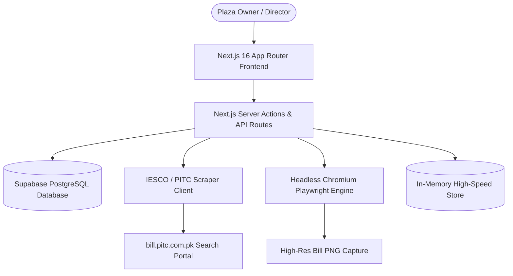
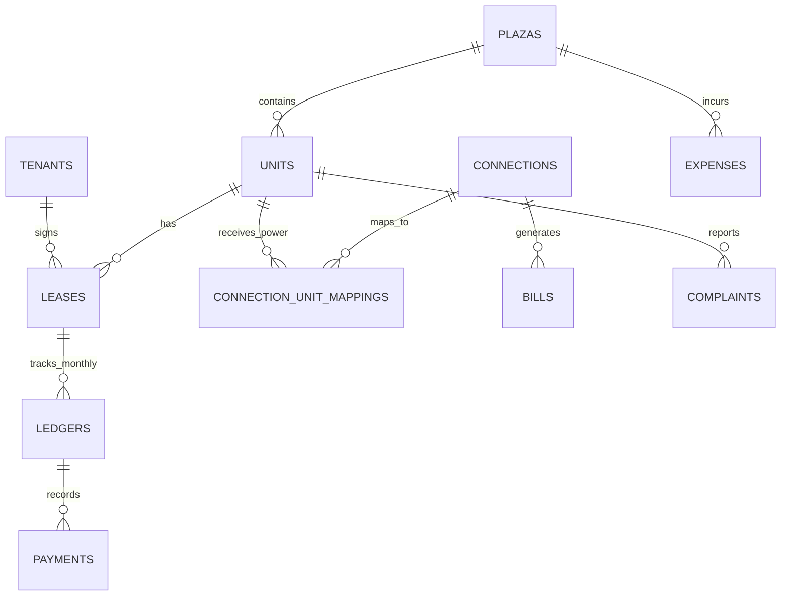

# 🏢 Plaza Manager — Complete System Architecture & Operations Guide

> **A simplified, intelligent commercial property and electricity management platform designed specifically for plaza owners, directors, and managers.**

---

## 📑 Table of Contents

1. [Executive Summary & Core Principle](#1-executive-summary--core-principle)
2. [Tech Stack & Architecture](#2-tech-stack--architecture)
3. [Project Directory & File Sitemap](#3-project-directory--file-sitemap)
4. [Comprehensive Feature & Module Breakdown](#4-comprehensive-feature--module-breakdown)
   - 4.1 [Home & Executive Dashboard (`/`)](#41-home--executive-dashboard-)
   - 4.2 [Shops & Rooms Management (`/units`)](#42-shops--rooms-management-units)
   - 4.3 [360° Unit Detail View (`/units/[id]`)](#43-360-unit-detail-view-unitsid)
   - 4.4 [Tenant Onboarding & Lease Lifecycle (`/tenants`)](#44-tenant-onboarding--lease-lifecycle-tenants)
   - 4.5 [Electricity Meter & IESCO Integration (`/connections`)](#45-electricity-meter--iesco-integration-connections)
   - 4.6 [Live IESCO Scraping & Playwright Bill Engine](#46-live-iesco-scraping--playwright-bill-engine)
   - 4.7 [Official Bill Viewer Modal (`ViewBillModal`)](#47-official-bill-viewer-modal-viewbillmodal)
   - 4.8 [Rent, Payments & WhatsApp Receipts (`/rent`)](#48-rent-payments--whatsapp-receipts-rent)
   - 4.9 [Maintenance & Complaint Resolution (`/complaints`)](#49-maintenance--complaint-resolution-complaints)
   - 4.10 [Plaza Expenses & Operational Costs (`/expenses`)](#410-plaza-expenses--operational-costs-expenses)
   - 4.11 [Financial Ledgers & Reports (`/reports`)](#411-financial-ledgers--reports-reports)
   - 4.12 [Plaza Setup & Reconfiguration Wizard (`/settings`)](#412-plaza-setup--reconfiguration-wizard-settings)
5. [Database Architecture & Data Models](#5-database-architecture--data-models)
6. [API Endpoints & Server Actions Reference](#6-api-endpoints--server-actions-reference)
7. [Step-by-Step User Workflows (Quick SOPs)](#7-step-by-step-user-workflows-quick-sops)
8. [Installation, Localhost & Deployment Guide](#8-installation-localhost--deployment-guide)

---

## 1. Executive Summary & Core Principle

### The Problem
Commercial plaza management in Pakistan is traditionally plagued by manual calculations, delayed electricity bill distribution from IESCO, disputes over shared meters, and fragmented record-keeping in paper notebooks or WhatsApp chats. Plaza owners and directors are often non-technical and overwhelmed by complex ERP software.

### The Solution
**Plaza Manager** bridges this gap with a single core philosophy:
> *"Setup can be flexible for ANY plaza structure. Daily operations must be as simple and intuitive as WhatsApp."*

- **Zero Clutter**: Clean cards, big touch-friendly buttons, clear status badges, and plain English with intuitive emojis (no technical jargon).
- **Automated Electricity Invoicing**: Automatic scraping from the official IESCO/PITC billing portal, high-resolution Playwright screenshot capture of paper bills, and automated division across shared rooms or dedicated shops.
- **Robust Resilience**: Built with a hybrid Supabase database backend that automatically falls back to an in-memory data store if the database is offline or unmigrated, ensuring zero downtime.

---

## 2. Tech Stack & Architecture



| Layer | Technology | Purpose |
| :--- | :--- | :--- |
| **Framework** | **Next.js 16.3 (Turbopack)** | Server Components, Server Actions, App Router |
| **Language** | **TypeScript 5** | End-to-end static type safety |
| **Styling** | **Tailwind CSS 3.4** | Clean, responsive card-based UI optimized for mobile & desktop |
| **Database** | **Supabase (PostgreSQL)** | Persistent storage for plazas, units, tenants, leases, bills & payments |
| **Scraping Engine** | **Axios + Tough-Cookie + Cheerio** | Live session and cookie handling to bypass CSRF and scrape PITC bills |
| **Visual Capture** | **Playwright (Chromium)** | High-DPI headless browser snapshotting of official utility bills |
| **Formatting** | **Custom PKR & Date Formatters** | Pakistani Rupee (`Rs. 50,000`), ordinal due days, monthly periods |

---

## 3. Project Directory & File Sitemap

```
d:\ARHAM\PLAZA\plaza-electricity-manager\
├── app/
│   ├── page.tsx                           # Home / Executive Dashboard
│   ├── layout.tsx                         # Global Navigation & Layout wrapper
│   ├── globals.css                        # Tailwind global stylesheets
│   ├── units/
│   │   ├── page.tsx                       # Floor-grouped Shops/Rooms overview
│   │   ├── actions.ts                     # Unit, Tenant & Meter Server Actions
│   │   └── [id]/page.tsx                  # 360° Comprehensive Unit Detail View
│   ├── tenants/
│   │   ├── page.tsx                       # Tenant directory & lease statuses
│   │   └── actions.ts                     # Tenant creation, vacating & updating
│   ├── rent/
│   │   ├── page.tsx                       # Monthly rent, electricity & dues ledger
│   │   └── actions.ts                     # Payment recording & ledger adjustments
│   ├── connections/
│   │   ├── page.tsx                       # Electricity connections & meter mappings
│   │   └── mapping-actions.ts             # Meter split formulas & unit mappings
│   ├── complaints/
│   │   ├── page.tsx                       # Maintenance issues & complaint lifecycle
│   │   └── actions.ts                     # Logging, assigning & resolving complaints
│   ├── expenses/
│   │   ├── page.tsx                       # Plaza operational expenses tracker
│   │   └── actions.ts                     # Adding & categorizing building expenses
│   ├── reports/
│   │   └── page.tsx                       # Income vs. Expense monthly reports
│   ├── settings/
│   │   └── page.tsx                       # Plaza Setup Wizard & system settings
│   ├── bills/[id]/
│   │   └── page.tsx                       # Dedicated Bill Document & image view
│   └── api/
│       ├── fetch-bill/route.ts            # Live IESCO scrape API endpoint
│       ├── bill-image/route.ts            # Playwright bill screenshot endpoint (GET/POST)
│       └── automation/sync-bills/route.ts # Cron job endpoint to sync all plaza bills
├── components/
│   ├── units/                             # UnitsManager, UnitDetailView, AddUnitModal, EditUnitModal, ConnectMeterModal
│   ├── tenants/                           # AddTenantModal, VacateTenantModal, TenantList
│   ├── payments/                          # RecordPaymentModal, PaymentReceiptModal
│   ├── bills/                             # ViewBillModal, DeleteBillButton
│   ├── complaints/                        # ComplaintsManager, AddComplaintModal, ComplaintDetailModal
│   ├── expenses/                          # ExpensesManager, AddExpenseModal
│   ├── connections/                       # ConnectionUnitMappingModal
│   └── settings/                          # PlazaSetupWizard, SettingsManager
├── lib/
│   ├── units/service.ts                   # Unit & Plaza CRUD, in-memory memory fallbacks
│   ├── tenants/service.ts                 # Tenant & Lease service
│   ├── electricity/service.ts             # Meters, split calculations & bill allocations
│   ├── ledgers/service.ts                 # Monthly financial ledgers & balance reconciliations
│   ├── payments/service.ts                # Payment transaction tracking & receipts
│   ├── complaints/service.ts              # Maintenance ticket management
│   ├── expenses/service.ts                # Operational expense ledger
│   ├── iesco/                             # fetch-bill.ts, parse-bill.js, generate-image.ts
│   ├── supabase/server.ts                 # Supabase server client
│   └── utils/format.ts                    # formatPKR, date formatters, due day formatters
└── supabase/
    └── complete_setup.sql                 # Complete database schema & migrations
```

---

## 4. Comprehensive Feature & Module Breakdown

### 4.1 Home & Executive Dashboard (`/`)
- **4 Key Stat Cards**:
  1. **💰 Rent Collected This Month** (Live total collected vs. total expected).
  2. **⚡ Electricity Dues** (Total electricity bill pending payment across all meters).
  3. **🏢 Plaza Occupancy** (Total occupied vs. vacant units with percentage bar).
  4. **🔧 Maintenance Issues** (Count of open complaints requiring attention).
- **🚨 Needs Attention Section**: Directly flags unpaid rents, overdue electricity bills, and critical repairs with 1-click action buttons.
- **✨ "All Clear! ✅" State**: Encouraging notification when all rents are paid and no repairs are pending.
- **👋 Quick Onboarding Tour**: Guides new plaza owners through 4 simple steps to set up their building.

### 4.2 Shops & Rooms Management (`/units`)
- **Floor-Grouped Layout**: Units are neatly organized under their respective floor headers (`📍 Basement`, `📍 Ground Floor`, `📍 1st Floor`, `📍 Residential Flats`).
- **Interactive Unit Cards**:
  - Displays Unit Name, Type (Shop 🏪 or Room 🚪), Asking Rent, and Status (`🟢 Occupied` or `⚪ Vacant`).
  - Occupied units display the active tenant's name and contact number.
  - Vacant units provide an instant **`+ Assign Tenant`** button.
- **Smart Unit Creation (`+ Add Unit`)**: 4-step wizard with intelligent rent and security suggestions based on selected floor.

### 4.3 360° Unit Detail View (`/units/[id]`)
- Comprehensive overview for a single shop/room:
  - **Header**: Occupancy status, tenant name, phone, CNIC, and quick actions (`💰 Received`, `🔧 Report Issue`, `🚪 Tenant Left`, `✏️ Edit Unit`).
  - **3 Big Focus Cards**:
    1. **💵 Monthly Rent**: Rent amount, due day, and collection progress.
    2. **⚡ Electricity**: Active bill amount, 14-digit IESCO Reference Number, Meter Number, Units Consumed, Due Date, `⚡ Sync IESCO Bill` button, `✏️ Edit Meter` button, and `📷 View Bill Image` link.
    3. **🛡️ Security Deposit**: Total advance deposit required, amount paid, and remaining balance.
  - **History Tabs**: Full ledger history of Payments, Electricity Bills, and Maintenance Complaints.

### 4.4 Tenant Onboarding & Lease Lifecycle (`/tenants`)
- **Zero Redundancy Smart Flow**:
  - When clicking **`+ Assign Tenant`** directly on a shop card (e.g. `Ground Shop G-01`), the modal automatically identifies and locks the shop, pre-fills the monthly rent and security deposit, and immediately presents the tenant contact fields without redundant questions.
  - If opened from the general header, vacant units are organized in a clean floor-grouped dropdown (`<optgroup>`).
- **Tenant Profile**: Full Name/Business Name, Phone Number, CNIC (13 digits), Emergency Family Contact, Move-in Date, and Lease Terms.
- **Tenant Departure (`🚪 Tenant Left`)**: Simple 1-click move-out flow that settles security deposit deductions and immediately marks the shop as vacant.

### 4.5 Electricity Meter & IESCO Integration (`/connections`)
- **Dedicated vs. Shared Connections**:
  - **Dedicated Meter (1-to-1)**: For commercial shops with their own independent IESCO electric meter.
  - **Shared Meter (1-to-Many)**: For residential flats or shared floors where one main meter is divided among multiple rooms (supports Equal Split % or Custom Split %).
- **Auto-Billing Sync**: Automatically divides the master IESCO bill across mapped rooms according to the configured formula.

### 4.6 Live IESCO Scraping & Playwright Bill Engine
- **Session-Aware Scraper (`lib/iesco/fetch-bill.ts`)**:
  - Connects to `https://bill.pitc.com.pk/iescobill`.
  - Simulates a real browser session to capture hidden CSRF tokens and submit reference numbers.
- **Cheerio Parser (`lib/iesco/parse-bill.js`)**:
  - Extracts 25+ bill data points: Reference Number, Consumer Name, Meter Number, Billing Month, Issue Date, Due Date, Previous Reading, Present Reading, Units Consumed, Electricity Cost, FPA, Taxes, Arrears, and Total Payable.
- **Playwright Image Capture (`lib/iesco/generate-image.ts`)**:
  - Launches headless Chromium at 2x DPI.
  - Removes loading overlays and captures a crystal-clear PNG image of the official bill document.

### 4.7 Official Bill Viewer Modal (`ViewBillModal`)
- Triggered by clicking **`📷 View Bill Image →`** on any unit.
- Displays:
  - **Official IESCO Bill Header** with reference number and consumer name.
  - **4 KPI Tiles**: Billing Month, Units Consumed (`⚡ 165 kWh`), Due Date, and Issue Date.
  - **Itemized Charges Breakdown Table**: Electricity energy cost, FPA, government duties, GST, and Late Payment Surcharges.
  - **Official Scanned Document**: 1-click **`📷 Load Official PITC Bill Image`** button to render the live captured PNG.
  - **🖨️ Print / Save as PDF** button for physical record-keeping.

### 4.8 Rent, Payments & WhatsApp Receipts (`/rent`)
- **3-Step Numbered Payment Modal (`RecordPaymentModal`)**:
  - **Step 1**: Big PKR Amount input.
  - **Step 2**: Visual tile buttons for Category (`🏠 Monthly Rent`, `⚡ Electricity Bill`, `🛡️ Security Deposit`, `🔧 Maintenance Charge`).
  - **Step 3**: Payment Method tiles (`💵 Cash`, `🏦 Bank Transfer`, `📱 Online App (JazzCash/EasyPaisa)`, `📜 Cheque`).
- **Clean Payment Receipt (`PaymentReceiptModal`)**:
  - Displays official Receipt Number, Date, Tenant Name, Shop Name, Amount Received, Payment Method, and Remaining Balance.
  - Includes **🖨️ Print Receipt** button and quick copy details for WhatsApp.

### 4.9 Maintenance & Complaint Resolution (`/complaints`)
- **Card-Based Maintenance Grid**:
  - Replaces complex tables with friendly cards showing the affected Shop, Issue Category (`💡 Electricity`, `🚰 Plumbing`, `🚪 Civil/Carpentry`, `🧹 Cleaning`, `🛡️ Security`), Priority, and Assigned Contractor/Staff.
- **3 Status Stages**: `🔴 Open` ➔ `🟡 In Progress` ➔ `✅ Fixed / Resolved`.
- **Cost Tracking**: Option to record repair costs for plaza financial reporting.

### 4.10 Plaza Expenses & Operational Costs (`/expenses`)
- Tracks building overheads: Generator Fuel, Sweeper/Janitorial, Security Guard Salaries, Common Area Electricity, Lift Maintenance, and Water Supply.
- Filterable by Category and Month with automatic deduction from plaza gross revenue.

### 4.11 Financial Ledgers & Reports (`/reports`)
- Comprehensive monthly income vs. expense reconciliation.
- Visual breakdown of Total Collected Rent + Electricity Recovery vs. Building Maintenance & Operational Costs = **Net Plaza Profit**.

### 4.12 Plaza Setup & Reconfiguration Wizard (`/settings`)
- **Multi-Floor Building Builder**:
  - Select floors present in your plaza (`Basement`, `Lower Ground`, `Ground Floor`, `1st Floor`, `2nd Floor`, `3rd Floor`, `Rooftop`, `Residential Flats`).
  - Configure the number of shops/rooms per floor and set default asking rents.
  - Click **"Save & Build Plaza Structure"** to generate all physical units instantly.

---

## 5. Database Architecture & Data Models



### Key Tables & Schema Definitions

#### `plazas`
| Field | Type | Description |
| :--- | :--- | :--- |
| `id` | UUID / BIGINT | Primary Key |
| `name` | TEXT | Plaza Name (e.g. "Main Commercial Plaza") |
| `address` | TEXT | Plaza physical location |
| `floors` | JSONB / TEXT[] | Configured floor levels |

#### `units`
| Field | Type | Description |
| :--- | :--- | :--- |
| `id` | BIGINT | Primary Key |
| `plaza_id` | BIGINT | Foreign Key to plazas |
| `unit_number` | TEXT | Unit Code (e.g. "G-01", "B-03") |
| `unit_name` | TEXT | Display Name (e.g. "Ground Shop G-01") |
| `unit_type` | TEXT | `'SHOP'` or `'ROOM'` |
| `floor` | TEXT | Floor label (e.g. "Ground", "Basement") |
| `default_monthly_rent` | NUMERIC | Standard asking rent in PKR |
| `default_security_amount`| NUMERIC | Standard security deposit advance |
| `default_rent_due_day` | INTEGER | Day of month rent is due (1-28) |
| `status` | TEXT | `'VACANT'`, `'OCCUPIED'`, `'INACTIVE'` |

#### `tenants` & `leases`
- `tenants`: Stores `full_name`, `phone`, `cnic`, `emergency_contact`, `status`.
- `leases`: Stores `tenant_id`, `unit_id`, `monthly_rent`, `rent_due_day`, `security_amount`, `security_paid`, `security_status`, `start_date`, `end_date`, `is_active`.

#### `connections` & `connection_unit_mappings`
- `connections`: Stores `reference_number` (14 digits), `meter_number`, `name`, `tenant`, `tariff`, `active`.
- `connection_unit_mappings`: Maps `connection_id` to `unit_id` with `split_type` (`'EQUAL'`, `'PERCENTAGE'`) and `split_value`.

#### `bills`
- Stores `connection_id`, `billing_month`, `bill_amount`, `units_consumed`, `due_date`, `issue_date`, `previous_reading`, `current_reading`, `arrears`, `late_payment_amount`, `status`, `bill_image_url`.

#### `ledgers` & `payments`
- `ledgers`: Monthly accounts per tenant with `rent_amount`, `electricity_amount`, `previous_balance`, `total_payable`, `paid_amount`, `remaining_balance`, `rent_status`.
- `payments`: Immutable payment audit log with `receipt_number`, `amount`, `payment_type`, `payment_method`, `payment_date`.

---

## 6. API Endpoints & Server Actions Reference

### Server Actions
- `getAvailableUnitsAction()`: Retrieves current building units with status and pricing.
- `createUnitAction(formData)`: Adds a single unit with optional electricity setup.
- `updateUnitAction(id, formData)`: Updates unit specifications, rent, and status.
- `connectUnitMeterAction(formData)`: Links a 14-digit IESCO reference number and meter number to a unit.
- `createTenantAction(formData)`: Creates a tenant and activates their lease agreement.
- `recordPaymentAction(formData)`: Logs a payment transaction and reconciles the monthly ledger.
- `bulkConfigurePlazaAction(payload)`: Builds/rebuilds full multi-floor plaza structure.

### API Routes
- `POST /api/fetch-bill`: Scrapes live IESCO HTML, parses metrics, and creates/updates the bill in database.
- `GET /api/bill-image?ref={refNo}`: Returns high-resolution PNG screenshot of the bill generated via Playwright.
- `POST /api/automation/sync-bills`: Automation route for scheduled cron jobs to sync all active plaza meters.

---

## 7. Step-by-Step User Workflows (Quick SOPs)

### Workflow A: First-Time Plaza Configuration
1. Go to **⚙️ Settings** ➔ **🏢 Setup / Reconfigure Plaza**.
2. Select your plaza's floors (e.g. Ground Floor, Basement).
3. Set the number of shops per floor and default rent.
4. Click **"Save & Build Plaza Structure"**.

### Workflow B: Connecting an Electricity Meter
1. Go to **🏢 Shops / Rooms** and open your shop (e.g. **Ground Shop G-01**).
2. On the **⚡ ELECTRICITY** card, click **`+ Add Meter Reference`** (or **`✏️ Edit Meter`**).
3. Select **Dedicated Meter** and paste your **14-digit IESCO reference number** (e.g. `04141234567890`).
4. (Optional) Enter the physical meter serial number (e.g. `MTR-G01`).
5. Click **`✅ Save & Connect Meter`** — the bill amount and metrics will appear immediately.

### Workflow C: Onboarding a New Tenant
1. Go to **🏢 Shops / Rooms** and click **`+ Assign Tenant`** on any vacant shop.
2. The shop name and asking rent will be auto-selected.
3. Enter the Tenant's **Full Name**, **Phone Number**, and **CNIC**.
4. Confirm Monthly Rent and Advance Security Deposit.
5. Click **`✅ Add Tenant`**.

### Workflow D: Receiving Rent / Electricity Payment
1. Open the occupied shop or go to **💵 Money & Rent**.
2. Click **`💰 Received`** (or **`+ Record Payment`**).
3. Type the amount received (e.g. `Rs. 35,000`).
4. Tap the category button (`🏠 Monthly Rent` or `⚡ Electricity Bill`).
5. Tap the payment method (`💵 Cash`, `🏦 Bank`, or `📱 Online`).
6. Click **`✅ Save Payment`** to print the receipt or share on WhatsApp.

---

## 8. Installation, Localhost & Deployment Guide

### Prerequisites
- **Node.js**: v18.0.0 or higher (v20+ recommended)
- **npm** or **pnpm**
- **Playwright Chromium**: `npx playwright install chromium`

### Local Setup
```bash
# 1. Clone or navigate to the project directory
cd d:\ARHAM\PLAZA\plaza-electricity-manager

# 2. Install dependencies
npm install

# 3. Install Playwright browser binaries
npx playwright install chromium

# 4. Configure environment variables in .env.local
NEXT_PUBLIC_SUPABASE_URL=https://your-project.supabase.co
NEXT_PUBLIC_SUPABASE_PUBLISHABLE_KEY=your-supabase-key

# 5. Start development server
npm run dev
```

The application will be live at **`http://localhost:3000`**.

---

*Documentation Version 2.0 · Maintained for Plaza Manager Core System*
