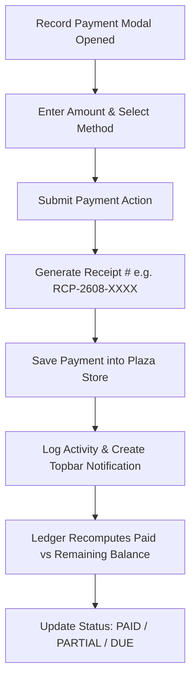

# Plaza Electricity & Property Manager — Complete Project Documentation

> **System:** Commercial Plaza & Utility Management System  
> **Repository:** [https://github.com/ArhamAmjad96/Plzaza](https://github.com/ArhamAmjad96/Plzaza)  
> **Technology Stack:** Next.js 15 (App Router), TypeScript, Tailwind CSS, Lucide Icons, Supabase, Disk-Backed JSON Persistence  
> **Deployment:** Vercel / Node.js  

---

## Table of Contents
1. [Project Overview](#1-project-overview)
2. [Key Features & Capabilities](#2-key-features--capabilities)
3. [Architecture & Technology Stack](#3-architecture--technology-stack)
4. [Module Breakdown & Directory Structure](#4-module-breakdown--directory-structure)
5. [Data Models & Persistence Schema](#5-data-models--persistence-schema)
6. [Core Workflows & Business Logic](#6-core-workflows--business-logic)
7. [Installation & Setup Guide](#7-installation--setup-guide)
8. [Deployment & Git Synchronization](#8-deployment--git-synchronization)

---

## 1. Project Overview

**Plaza Electricity & Property Manager** is an enterprise-grade commercial property and utility management platform tailored for plaza owners, property managers, and commercial landlords. 

The application solves the complexities of multi-tenant commercial real estate in Pakistan and emerging markets, with dedicated handling for:
- Commercial shops, rooms, and floor allocations.
- Real-time electricity billing integration via 14-digit WAPDA/DISCO reference numbers.
- Automated monthly rent, utility, and security deposit ledgers.
- Cash/Bank payment recording with instant receipt generation.
- Maintenance ticketing & plaza operating expenses.
- Real-time notification bell and security/operations audit logs.

---

## 2. Key Features & Capabilities

### 🏢 1. Plaza Setup & Rebuilding Wizard (`/settings`)
- Configure plaza name, address, description, and floor layouts (Ground Floor, 1st Floor, Basement, Mezzanine, etc.).
- Bulk unit generation with configurable rent, security deposit defaults, and due dates.
- One-click plaza rebuild or reset option.

### 🏬 2. Shops & Rooms Management (`/units`, `/units/[id]`)
- Interactive unit directory categorized by floor and occupancy status (`OCCUPIED` vs `VACANT`).
- Dedicated detail pages for each shop/room displaying tenant history, linked electricity meter, and lease terms.
- Add, edit, or remove individual units.

### 👥 3. Tenant Directory & Lease Management (`/tenants`)
- Complete tenant profiles with CNIC, emergency contact, phone number, and lease terms.
- Onboarding modal linking tenants to available units with security deposit tracking (`PAID`, `PARTIAL`, `UNPAID`).
- Annual rent escalation percentage support.

### 💳 4. Rent Collections & Financial Ledgers (`/rent`)
- Consolidated monthly billing matrix displaying Expected Total, Collected Amount, and Remaining Dues.
- **Record Payment Modal**: Accepts cash, bank transfer, cheque, or online payment with instant auto-generated receipt numbers (e.g. `RCP-2608-5192`).
- Dynamically calculates remaining balances and updates statuses (`PAID`, `PARTIAL`, `DUE`).

### ⚡ 5. Electricity Meters & Sub-metering (`/connections`)
- Attach 14-digit DISCO reference numbers directly to shops or plaza main meters.
- Multi-tenant shared meter bill splitting based on sub-meter kWh units or custom percentages.
- Bill scraping and online bill viewing integration.

### 🛠️ 6. Maintenance & Complaints Tracker (`/complaints`)
- Track tenant repair tickets (Electrical, Plumbing, Structural, HVAC).
- Priority badges (`URGENT`, `HIGH`, `MEDIUM`, `LOW`) and status workflow (`OPEN` ➔ `IN_PROGRESS` ➔ `RESOLVED`).
- Associated repair expense logging.

### 🧾 7. Plaza Operating Expenses (`/expenses`)
- Track plaza-wide overheads (Janitorial, Security, Maintenance, Common Area Utilities, Taxes).
- Monthly expense breakdown and net cash flow insights.

### 📜 8. System Audit Logs & Notification Bell (`/logs`)
- **Top Bar Notification Bell**: Live unread counter badge, notification drawer, and "Mark all read" action.
- **Audit Logs Dashboard**: Complete historical log feed for all events (Plaza Setup, Units, Tenants, Payments, Meters, Maintenance).
- Real-time search and category filtering with 1-click **"View Module"** navigation.

---

## 3. Architecture & Technology Stack

| Layer | Technology | Description |
|---|---|---|
| **Framework** | Next.js 15 (App Router) | Server-Side Rendering (SSR), Server Actions, and React Server Components |
| **Language** | TypeScript | Strong type-safety across models, services, and UI components |
| **Styling** | Tailwind CSS | Modern high-contrast color palette, custom fonts, and responsive layout |
| **Icons** | Lucide React | Clean, scalable icon library |
| **Primary Database** | Supabase (PostgreSQL) | Cloud database with full relational integrity |
| **Local Store Fallback** | Disk-Backed JSON Store | Zero-downtime offline fallback (`data/plaza_store.json`) |

---

## 4. Module Breakdown & Directory Structure

```
plaza-electricity-manager/
├── app/
│   ├── layout.tsx                # Root application layout (Sidebar, Topbar, Content)
│   ├── page.tsx                  # Executive Dashboard / Overview
│   ├── units/                    # Shops & Units directory and [id] details
│   ├── tenants/                  # Tenant directory & onboarding actions
│   ├── rent/                     # Rent collections, ledgers, and payment modal
│   ├── connections/              # Electricity meters & reference number management
│   ├── complaints/               # Maintenance tickets & repair workflows
│   ├── expenses/                 # Plaza operating expenses
│   ├── logs/                     # System activity & audit logs
│   └── settings/                 # Plaza wizard & layout reconfiguration
├── components/
│   ├── navigation/
│   │   ├── Sidebar.tsx           # Desktop navigation sidebar
│   │   ├── Topbar.tsx            # Sticky top bar with date & notification bell
│   │   ├── NotificationBell.tsx  # Live interactive notification dropdown
│   │   └── MobileBottomNav.tsx   # Mobile floating drawer navigation
│   ├── logs/
│   │   └── AuditLogManager.tsx   # Audit logs search, category filters & timeline
│   ├── payments/
│   │   └── RecordPaymentModal.tsx# Rent & security payment recording modal
│   └── units/
│       └── UnitCard.tsx          # Responsive unit cards
├── lib/
│   ├── storage/
│   │   └── fileStore.ts          # Disk-backed JSON store persistence engine
│   ├── logs/
│   │   └── service.ts            # Audit logging & notification dispatch service
│   ├── units/
│   │   └── service.ts            # Unit CRUD, floor groupings, plaza setup
│   ├── tenants/
│   │   └── service.ts            # Tenant profiles & active lease bindings
│   ├── ledgers/
│   │   └── service.ts            # Monthly dues calculation & rent roll balance
│   ├── payments/
│   │   └── service.ts            # Transaction logging & receipt generation
│   ├── electricity/
│   │   └── service.ts            # 14-digit meter reference bindings
│   ├── expenses/
│   │   └── service.ts            # Operating expense management
│   └── complaints/
│       └── service.ts            # Maintenance ticketing workflows
├── data/
│   └── plaza_store.json          # Persistent local store
└── PROJECT_DOCUMENTATION.md      # Full system documentation
```

---

## 5. Data Models & Persistence Schema

### 1. Plaza (`PlazaItem`)
```typescript
interface PlazaItem {
  id: number | string;
  name: string;
  address?: string;
  description?: string;
  floors?: string[];
  active?: boolean;
}
```

### 2. Unit (`UnitItem`)
```typescript
interface UnitItem {
  id: number | string;
  plaza_id: number | string;
  unit_number: string;
  unit_name: string;
  unit_type: "SHOP" | "ROOM" | "OTHER";
  floor: string;
  default_monthly_rent: number;
  default_security_amount: number;
  default_rent_due_day: number;
  status: "VACANT" | "OCCUPIED" | "MAINTENANCE";
  notes?: string | null;
}
```

### 3. Tenant & Lease (`TenantItem`, `LeaseItem`)
```typescript
interface TenantItem {
  id: number | string;
  full_name: string;
  phone?: string | null;
  cnic?: string | null;
  status: "ACTIVE" | "VACATED" | "INACTIVE";
}

interface LeaseItem {
  id: number | string;
  tenant_id: number | string;
  unit_id: number | string;
  monthly_rent: number;
  rent_due_day: number;
  security_amount: number;
  security_paid: number;
  security_status: "PAID" | "PARTIAL" | "UNPAID";
  move_in_date: string;
  lease_start_date: string;
  status: "ACTIVE" | "ENDED" | "TERMINATED";
}
```

### 4. Payment (`PaymentTransaction`)
```typescript
interface PaymentTransaction {
  id: number | string;
  unit_id?: number | string;
  tenant_id?: number | string;
  lease_id?: number | string;
  connection_id?: number | string;
  payment_type: "RENT" | "ELECTRICITY" | "SECURITY" | "OTHER";
  amount: number;
  payment_date: string;
  billing_month: string;
  payment_method: "CASH" | "BANK_TRANSFER" | "CHEQUE" | "ONLINE";
  receipt_number: string;
}
```

### 5. Audit Log & Notification (`ActivityLogItem`, `NotificationItem`)
```typescript
interface ActivityLogItem {
  id: string | number;
  category: "PLAZA" | "UNITS" | "TENANTS" | "PAYMENTS" | "ELECTRICITY" | "MAINTENANCE" | "EXPENSES";
  action: string;
  title: string;
  description: string;
  metadata?: Record<string, any> | null;
  actor?: string;
  created_at: string;
}

interface NotificationItem {
  id: string | number;
  log_id?: string | number;
  category: string;
  title: string;
  message: string;
  href?: string;
  read: boolean;
  created_at: string;
}
```

---

## 6. Core Workflows & Business Logic

### Payment & Ledger Balance Algorithm


---

## 7. Installation & Setup Guide

### Prerequisites
- **Node.js**: v18.18.0 or higher
- **npm** or **pnpm** / **yarn**

### Quick Start
```bash
# 1. Clone the repository
git clone https://github.com/ArhamAmjad96/Plzaza.git
cd Plzaza/plaza-electricity-manager

# 2. Install dependencies
npm install

# 3. Configure environment variables (optional for Supabase cloud sync)
cp .env.example .env.local

# 4. Launch development server
npm run dev
```

Open [http://localhost:3000](http://localhost:3000) in your browser.

---

## 8. Deployment & Git Synchronization

The project is synchronized across both `master` and `main` branches for seamless Vercel or custom host deployment:

```bash
# Push updates to both branches
git add .
git commit -m "feat: updates"
git push origin master
git push origin master:main
```

---
*Generated by Plaza Electricity Manager System — Comprehensive Documentation*
