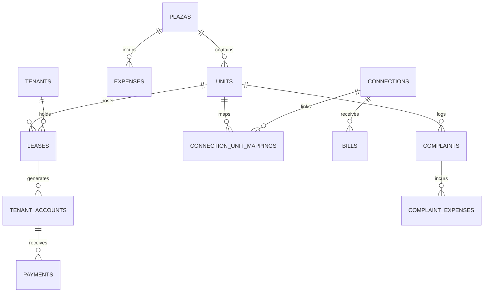

# 🏢 Plaza Management System — Complete Project Documentation

A modern, scalable property management platform built for commercial plazas, retail markets, office complexes, and residential flat buildings.

---

## 📑 Table of Contents
1. [Project Vision & Core Philosophy](#1-project-vision--core-philosophy)
2. [Technology Stack & Architecture](#2-technology-stack--architecture)
3. [Two Distinct Experiences](#3-two-distinct-experiences)
4. [Core Modules Breakdown](#4-core-modules-breakdown)
5. [Database Architecture & Entity Relationships](#5-database-architecture--entity-relationships)
6. [IESCO / PITC Electricity Billing & Playwright Engine](#6-iesco--pitc-electricity-billing--playwright-engine)
7. [Step-by-Step Owner Operation Guide](#7-step-by-step-owner-operation-guide)
8. [Multi-Plaza Scalability](#8-multi-plaza-scalability)

---

## 1. Project Vision & Core Philosophy

### The Problem
Traditional property and accounting software is built for accountants and software developers, filled with overwhelming terminology like *Ledger Adjustments*, *Sub-ledger Allocations*, *Multi-tier Tax Schedules*, and *Cron Job Monitors*. The actual plaza owner wants simple, practical answers to basic questions:
- *Who owes me money this month?*
- *What repairs need my attention?*
- *How much profit did I make after paying staff salaries and electricity?*

### The Solution Principle
> **"Setup can be flexible for ANY plaza. Daily use must be radically simple for the owner."**

The internal backend is decoupled and powerful (handling multi-unit electricity splits, Playwright browser scraping, and double-entry ledger calculations), while the user experience is intuitive (**Shop → Person → Paisa → Masla → Kharcha**).

---

## 2. Technology Stack & Architecture

| Layer | Technology | Key Capabilities |
| :--- | :--- | :--- |
| **Frontend & UI** | **Next.js 16** (Turbopack, App Router, React 19) | Server Components, Server Actions, Responsive Desktop & Mobile layout |
| **Styling** | **Tailwind CSS** | Clean cards, status badges, typography, printable letterheads |
| **Database** | **Supabase PostgreSQL** | Scoped `plaza_id` architecture, relational integrity, row-level security |
| **Resilience Layer** | **In-Memory Fallback Stores** | Zero-crash guarantee during remote schema updates or initial deployment |
| **Automation Engine** | **Playwright + Node.js** | Headless automated browser capturing high-resolution original IESCO bill images |
| **Utility Sync** | **IESCO / PITC Scraping API** | Automated 14-digit reference scraping, HTML bill parsing, sub-unit cost allocation |

---

## 3. Two Distinct Experiences

### 1. Plaza Setup & Configuration (Settings)
Used when a new plaza is configured or structural renovations take place:
- Building Name & Location setup
- Custom Floors hierarchy (*Basement, Lower Ground, Ground Floor, 1st Floor, 2nd Floor, Rooftop*)
- Bulk Shop / Room Generator with automatic numbering (`B-01` to `B-05`, `G-01` to `G-12`)
- Default Monthly Rent & Security Deposit rules per floor
- Residential Flats and rentable rooms setup
- Dedicated or Shared Electricity meter configuration

### 2. Daily Use (5 Simple Touchpoints)
1. 🏠 **Home** — Answers: *Who owes money?*, *What needs attention?*, *What happened this month?*
2. 🏢 **Shops / Rooms** — Floor-by-floor interactive building layout with 360° shop profile.
3. 💰 **Money** — Simple Expected vs. Received vs. Due tracker with 1-click payment recording.
4. 🔧 **Maintenance** — Visual maintenance logging with 1-click repair cost recording.
5. 📊 **Monthly Hisab** — Clear Net Cash Flow statement ($\text{Income} - \text{Expenses}$) with printable PDF export.

---

## 4. Core Modules Breakdown

```
┌──────────────────────────────────────────────────────────┐
│                   PLAZA MANAGEMENT SYSTEM                │
├─────────────┬─────────────┬─────────────┬────────────────┤
│ 🏠 Home     │ 🏢 Units    │ 💰 Money    │ 🔧 Maintenance │
│ Dashboard   │ & Tenants   │ & Payments  │ & Complaints   │
├─────────────┼─────────────┼─────────────┼────────────────┤
│ 📊 Monthly  │ ⚙️ Setup    │ 🔌 Meters   │ 🤖 Automation  │
│ Hisab (P&L) │ & Settings  │ & Scraping  │ & Cron Jobs    │
└─────────────┴─────────────┴─────────────┴────────────────┘
```

### Module 1: Home Dashboard (`/`)
- **This Month Summary**: Big numbers showing **Rent Received**, **Money Still Due**, and **Plaza Running Expenses**.
- **Needs Attention Panel**: Interactive cards highlighting overdue rents, unpaid electricity bills, open maintenance issues, and incomplete security deposits.
- **5 Quick Actions**: `➕ Add Unit`, `👤 Add Tenant`, `💰 Record Payment`, `🔧 Add Complaint`, `💸 Add Expense`.

### Module 2: Shops & Rooms (`/units`)
- Visual floor plan grouping shops and flat rooms under their respective floor headings.
- Occupancy badges: 🟢 **OCCUPIED** (displays tenant name and rent status) vs. ⚪ **VACANT** (1-click `+ Assign Tenant`).
- **360° Single Unit Profile (`/units/[id]`)**:
  - Tenant contacts & phone number
  - Monthly rent amount, due date, and payment status (`✅ PAID` / `🔴 UNPAID`)
  - Electricity meter reference, current bill amount, and original bill picture link
  - Security deposit required vs. received vs. remaining
  - Open maintenance issues for this unit
  - Complete history tabs: Payments, Monthly Ledgers, Maintenance

### Module 3: Money & Payments (`/rent`)
- Tracks monthly collections for the current or past billing months.
- Replaces complex accounting terms with plain language: **Expected Rent**, **Received**, **Remaining Due**.
- **`+ Record Payment` Modal**:
  - Who paid?
  - What for? (*Rent*, *Electricity*, *Security*, *Other*)
  - Amount in PKR
  - Payment method (*Cash*, *Bank Transfer*, *Online*, *Cheque*)
- **Digital Printable Receipts**: Generates branded payment receipts with receipt number, breakdown, and signature block.

### Module 4: Maintenance & Complaints (`/complaints`)
- Minimal issue reporting with visual category cards:
  - ⚡ *Electricity* • 💧 *Water / Plumbing* • 🧱 *Wall / Paint* • 🚪 *Door / Lock* • 🚽 *Washroom* • 🏗 *Other*
- Urgency toggles: **Normal** vs. **🔴 Urgent**.
- **1-Click Repair Cost Recording**: When marking a complaint as resolved, prompts for Material + Labour cost and **automatically includes it in plaza expenses** without requiring duplicate entry.

### Module 5: General Plaza Expenses (`/expenses`)
- Records recurring operational running costs:
  - 👮 *Security Guard Salary*
  - 🧹 *Janitorial & Sweeper Wages*
  - ⛽ *Generator Diesel Fuel*
  - 💡 *Common Area Electricity & Water*
  - 🗑️ *Waste Disposal Fee*
  - 🏛️ *Taxes & Legal Costs*

### Module 6: Monthly Hisab & Reports (`/reports`)
- Executive Financial Statement:
  $$\text{Net Cash Flow} = \text{Total Collections} - (\text{Operating Expenses} + \text{Maintenance Repairs})$$
- 5 Specialized Statements:
  1. Net Cash Flow Statement (P&L)
  2. Rent Collection & Outstanding Balance Sheet
  3. Electricity Consumption & Billing Report
  4. Security Deposits Held Registry
  5. Plaza Running Expense Breakdown
- **Print / PDF Export**: Formatted with executive letterheads and management signature lines.

---

## 5. Database Architecture & Entity Relationships

The PostgreSQL database is organized with clean separation between physical spaces, tenant occupancies, utility meters, and financial ledgers:



### Table Definitions:
1. **`plazas`**: Plaza name, location, contact, and JSONB `floors` hierarchy.
2. **`units`**: Physical shops and rooms (`unit_number`, `unit_name`, `unit_type`, `floor`, `default_monthly_rent`, `default_security_amount`, `status`).
3. **`tenants`**: Personal identity (`full_name`, `phone`, `cnic`, `emergency_contact`, `status`).
4. **`leases`**: Legal occupancy agreements (`monthly_rent`, `security_amount`, `security_paid`, `rent_due_day`, `move_in_date`, `annual_increase_pct`).
5. **`connections`**: Raw utility meters (`name`, `reference_number`, `meter_number`, `active`).
6. **`connection_unit_mappings`**: Rules linking meters to units (`split_type`: EQUAL / PERCENTAGE, `split_value`: 100% or 50%).
7. **`bills`**: Fetched IESCO bills (`billing_month`, `bill_amount`, `units_consumed`, `due_date`, `status`, `bill_image_url`).
8. **`tenant_accounts`**: Monthly billing ledger (`rent_amount`, `rent_status`, `electricity_amount`, `electricity_status`, `total_payable`, `paid_amount`, `remaining_balance`).
9. **`payments`**: Transaction records (`receipt_number`, `payment_type`, `amount`, `payment_method`, `payment_date`).
10. **`complaints`**: Maintenance issues (`category`, `title`, `priority`, `status`, `assigned_to`).
11. **`complaint_expenses`**: Repair costs linked to specific complaints.
12. **`expenses`**: General plaza operational expenses (`category`, `amount`, `expense_date`, `paid_to`, `receipt_voucher_no`).

---

## 6. IESCO / PITC Electricity Billing & Playwright Engine

### Live Utility Automation
1. **Reference Number Architecture**:
   - Each connection stores a 14-digit IESCO reference number (e.g. `04141234567890`).
2. **Automated Scraping**:
   - Queries the official PITC billing server (`http://bill.pitc.com.pk/iescobill/general?refno=...`).
   - Parses electricity cost, taxes, units consumed, issue date, and due date.
3. **Original Bill Image Capture**:
   - Uses a background **Playwright** headless browser to render the official paper bill HTML and capture a crystal-clear PNG screenshot.
   - Saves the screenshot and makes it viewable via `/bills/[id]`.
4. **Sub-Unit Split Calculation**:
   - **Dedicated Meter**: 100% of the bill is applied to that specific shop.
   - **Shared Meter (Flats)**: Automatically divides the bill across linked flat rooms (e.g. 50% for Room 1, 50% for Room 2) without fetching duplicate bills or creating duplicate connections.

---

## 7. Step-by-Step Owner Operation Guide

### A. Initial Plaza Setup (One-time)
1. Open **[http://localhost:3000/settings](http://localhost:3000/settings)** $\rightarrow$ click **`🏢 Setup / Reconfigure Plaza`**.
2. Enter building name and customize floor names.
3. Type shop counts per floor $\rightarrow$ the system auto-generates unit numbers.
4. Set default monthly rent and security deposit per floor.
5. Click **`✓ Save & Build Plaza Structure`**.

### B. Adding a Unit with Electricity (Anytime)
1. Click **`➕ Add Unit`** on **[http://localhost:3000/units](http://localhost:3000/units)**.
2. Step 1: Choose `🏪 Commercial Shop` or `🚪 Rentable Room`.
3. Step 2: Choose floor and unit name.
4. Step 3: Confirm suggested rent and security.
5. Step 4: Choose Electricity option:
   - `✅ Own Meter`: Type 14-digit IESCO reference number $\rightarrow$ *backend automatically links the meter!*
   - `🔗 Shares Meter`: Pick existing meter and 50/50 split.
   - `⚡ Add Later`: Save unit without meter.
6. Confirmation screen offers **`👤 Add Tenant Now`**.

### C. Daily Operations
- **Morning Check**: Open **[http://localhost:3000/](http://localhost:3000/)** to view overdue rents and urgent complaints.
- **Receive Rent / Bill**: Open **[http://localhost:3000/rent](http://localhost:3000/rent)** $\rightarrow$ click **`+ Record Payment`** $\rightarrow$ print official receipt.
- **Report Maintenance**: Open **[http://localhost:3000/complaints](http://localhost:3000/complaints)** $\rightarrow$ click **`+ Add Complaint`** $\rightarrow$ tap problem icon.
- **End of Month Review**: Open **[http://localhost:3000/reports](http://localhost:3000/reports)** $\rightarrow$ click **`🖨️ Print Statement`**.

---

## 8. Multi-Plaza Scalability

The application is structured to support pitching and managing **any commercial plaza**:
- ✅ **No hardcoded units or floor limits**: Can manage a 6-shop mini-market or a 150-unit commercial center.
- ✅ **Custom Floor Terminology**: Supports *Basement*, *Lower Ground*, *Mezzanine*, *Ground Floor*, *1st to 10th Floors*, *Offices*, and *Residential Flats*.
- ✅ **Dynamic Pricing**: Every unit inherits floor defaults but remains 100% individually editable.
- ✅ **Decoupled Tenants & Units**: When a tenant vacates, historical payments, ledgers, and complaints are preserved forever while the unit becomes vacant for a new lease.
