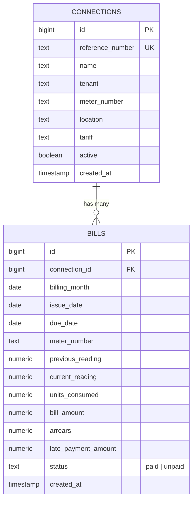

# Plaza Electricity Manager — Comprehensive Project Documentation

A modern web application built with **Next.js 16 (App Router)**, **TypeScript**, **Supabase**, and **Playwright** for automated IESCO (Islamabad Electric Supply Company) electricity bill fetching, data parsing, tenant management, and high-resolution bill image rendering.

---

## 📐 Table of Contents

1. [Project Overview](#-project-overview)
2. [Tech Stack & Dependencies](#-tech-stack--dependencies)
3. [Directory Architecture](#-directory-architecture)
4. [Core Features & How They Work](#-core-features--how-they-work)
   - [1. Real-time IESCO Bill Scraping & Parsing](#1-real-time-iesco-bill-scraping--parsing)
   - [2. On-Demand Original Bill PNG Image Generator](#2-on-demand-original-bill-png-image-generator)
   - [3. Supabase Database Synchronization](#3-supabase-database-synchronization)
   - [4. Dashboard & Analytics](#4-dashboard--analytics)
   - [5. Connection & Tenant Management](#5-connection--tenant-management)
5. [API Reference](#-api-reference)
6. [Database Schema](#-database-schema)
7. [Getting Started & Running Locally](#-getting-started--running-locally)

---

## 🚀 Project Overview

The **Plaza Electricity Manager** allows plaza managers and landlords to effortlessly manage electricity meters across multiple shops/tenants.

Instead of manually checking paper bills or visiting the PITC portal for each reference number, this application:
- **Fetches live bills** directly from PITC (`bill.pitc.com.pk`).
- **Parses bill metrics** (meter readings, units consumed, due dates, total bill amount, late fees) into structured database records.
- **Renders exact original bill images** as crisp PNGs using server-side Playwright Chromium rendering.
- **Tracks payment statuses** (paid vs unpaid) and financial summaries.

---

## 🛠 Tech Stack & Dependencies

| Category | Technology | Description |
| :--- | :--- | :--- |
| **Framework** | Next.js 16 (App Router) | React Server Components & Turbopack |
| **Language** | TypeScript & JavaScript (ESNext) | Strict type safety and ES module support |
| **Styling** | Tailwind CSS v4 | Clean UI with Slate & Blue design system |
| **Database** | Supabase (PostgreSQL) | Cloud database storing connections and bills |
| **Scraping** | Axios, Tough-Cookie, Cheerio | Session cookie handling & HTML DOM parsing |
| **Rendering** | Playwright (Chromium) | Server-side HTML rendering to high-DPI PNG |

---

## 📁 Directory Architecture

```text
plaza-electricity-manager/
├── app/                        # Next.js App Router (Pages & Server Actions)
│   ├── api/                    # Serverless API Endpoints
│   │   ├── bill-image/         # POST /api/bill-image (PNG Image Stream)
│   │   └── fetch-bill/         # POST /api/fetch-bill (Data Save to Supabase)
│   ├── bills/[id]/             # Single Bill Detail Page & Actions
│   ├── connections/            # Plaza Meter Connections Management Pages
│   │   └── [id]/edit/          # Edit Connection & Tenant Details
│   ├── tenants/                # Tenant Directory & Management Page
│   ├── globals.css             # Tailwind CSS Configuration
│   ├── layout.tsx              # Root HTML Layout & Font Providers
│   └── page.tsx                # Main Dashboard with Analytics & Recent Bills
│
├── components/                 # Reusable React UI Components
│   ├── bills/
│   │   ├── FetchBillForm.tsx   # Search form, real-time fetching, modal lightbox
│   │   └── DeleteBillButton.tsx# Client component for bill deletion prompts
│   └── connections/
│       └── FetchBillButton.tsx # Quick-refetch button on connection pages
│
├── lib/                        # Backend Services & Third-Party Integrations
│   ├── iesco/                  # IESCO/PITC Integration Package
│   │   ├── fetch-bill.ts       # Session cookie client & PITC POST request
│   │   ├── generate-image.ts   # Playwright Chromium HTML-to-PNG renderer
│   │   └── parse-bill.js       # Cheerio HTML parser extracting 15+ bill fields
│   └── supabase/
│       └── server.ts           # Supabase Database Client Initialization
│
├── .env.local                  # Environment Variables (Supabase Keys)
├── next.config.ts              # Next.js Configuration
└── tsconfig.json               # TypeScript Compiler Settings & Path Aliases (@/*)
```

---

## ⚙ Core Features & How They Work

### 1. Real-time IESCO Bill Scraping & Parsing
- **Location**: `lib/iesco/fetch-bill.ts` & `lib/iesco/parse-bill.js`
- **Flow**:
  1. The server opens `https://bill.pitc.com.pk/iescobill` using an `axios` instance wrapped with `tough-cookie`.
  2. It reads hidden CSRF/session form tokens from the search page HTML using `cheerio`.
  3. It submits a POST request containing `searchTextBox: referenceNumber` and `rbSearchByList: refno`.
  4. `parse-bill.js` extracts bill details such as reference number, tenant name/address, meter number, billing month, issue date, due date, previous/present readings, units consumed, total bill amount, arrears, and late surcharge.

### 2. On-Demand Original Bill PNG Image Generator
- **Location**: `lib/iesco/generate-image.ts` & `app/api/bill-image/route.ts`
- **Flow**:
  1. Receives reference number and fetches raw HTML from PITC.
  2. Launches headless **Chromium** via Playwright at retina resolution (`deviceScaleFactor: 2`, viewport `1200x1600`).
  3. Injects `<base href="https://bill.pitc.com.pk/">` so external CSS styles, fonts, and images resolve correctly.
  4. Automatically injects CSS overrides to hide PITC's animated *"Loading your bill"* modal (`#loader-container`) and unblur bill text.
  5. Captures a crisp PNG screenshot of the `#maincontent-1` bill container.
  6. Streams the binary PNG image directly to the client with `Content-Type: image/png`.
  7. Frontend displays the image with **View Fullscreen Lightbox**, **Print Bill**, and **Download PNG** options.

### 3. Supabase Database Synchronization
- **Location**: `app/api/fetch-bill/route.ts`
- **Flow**:
  1. When a bill is fetched, the server checks if the connection exists in the `connections` table.
  2. If missing, it automatically creates a new connection record linked to the tenant.
  3. It upserts (inserts or updates on conflict of `connection_id, billing_month`) the bill metrics in the `bills` table.

### 4. Dashboard & Analytics
- **Location**: `app/page.tsx`
- Displays key statistics:
  - **Active Connections**: Total active meters monitored.
  - **Bills This Month**: Number of records fetched for the current billing cycle.
  - **Total Electricity Expense**: Aggregated sum of bill amounts across all shops.
  - **Pending Payments**: Count and monetary sum of unpaid bills.
  - **Recent Bills Table**: Quick list of recent bills with status badges and navigation links.

### 5. Connection & Tenant Management
- **Location**: `app/connections/` & `app/tenants/`
- Allows plaza managers to view meter details by connection, edit shop/tenant names, toggle active status, and view historical bill trends per connection.

---

## 📡 API Reference

### `POST /api/fetch-bill`
Fetches bill from PITC, parses data, and saves to Supabase database.

- **Request Body**:
  ```json
  {
    "tenant": "Shop 12 - Mobile Hub",
    "referenceNumber": "15142165161900"
  }
  ```
- **Response** (200 OK):
  ```json
  {
    "success": true,
    "bill": {
      "id": "102",
      "connection_id": "5",
      "billing_month": "2026-08-01",
      "units_consumed": 450,
      "bill_amount": 18500,
      "status": "unpaid"
    }
  }
  ```

---

### `POST /api/bill-image`
Fetches original PITC bill HTML and returns an on-demand PNG screenshot stream.

- **Request Body**:
  ```json
  {
    "referenceNumber": "15142165161900"
  }
  ```
- **Response**: Binary stream with headers:
  - `Content-Type: image/png`
  - `Cache-Control: no-store, max-age=0`

---

## 🗄 Database Schema



---

## 🚦 Getting Started & Running Locally

### Environment Setup
Ensure `.env.local` contains valid Supabase credentials:
```env
NEXT_PUBLIC_SUPABASE_URL=https://<your-project-id>.supabase.co
NEXT_PUBLIC_SUPABASE_PUBLISHABLE_KEY=sb_publishable_<your-key>
```

### Install Dependencies & Browsers
```bash
npm install
npx playwright install chromium
```

### Run Development Server
```bash
npm run dev
```
Open [http://localhost:3000](http://localhost:3000) in your browser.
