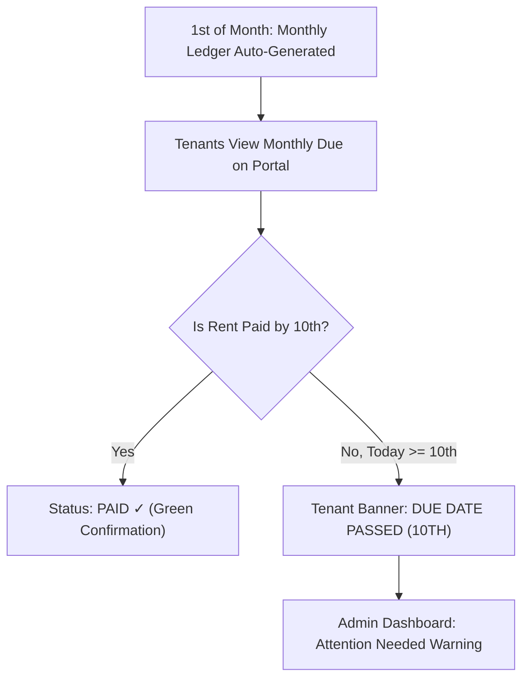
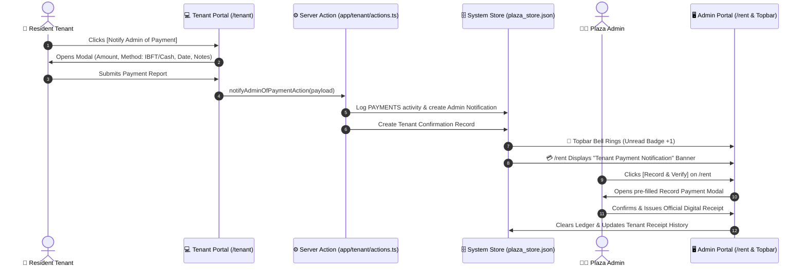
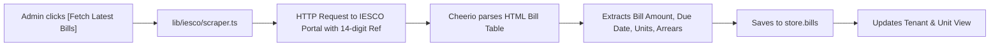

# 🏢 Plaza Management System — Complete Project Documentation

> **Version:** 1.0.0  
> **Architecture:** Full-Stack Next.js 16 (React 19, TypeScript, Tailwind CSS v4)  
> **Domain:** Commercial Plaza, Rental Property & Utility Management System  
> **Storage:** Hybrid Local FileStore (`data/plaza_store.json`) with Supabase PostgreSQL Sync Support  

---

## 📑 Table of Contents
1. [Executive Summary & Purpose](#1-executive-summary--purpose)
2. [Technology Stack & Dependencies](#2-technology-stack--dependencies)
3. [User Roles & Security Architecture](#3-user-roles--security-architecture)
4. [Comprehensive Module Breakdown](#4-comprehensive-module-breakdown)
   - [4.1 Executive Overview Dashboard (`/`)](#41-executive-overview-dashboard-)
   - [4.2 Rent & Ledger Financial Hub (`/rent`)](#42-rent--ledger-financial-hub-rent)
   - [4.3 Payment Records & Official Receipts (`/payments`)](#43-payment-records--official-receipts-payments)
   - [4.4 Tenant Directory & Admin Credentials Vault (`/tenants`)](#44-tenant-directory--admin-credentials-vault-tenants)
   - [4.5 Commercial Units & Floor Spaces (`/units`)](#45-commercial-units--floor-spaces-units)
   - [4.6 IESCO Electricity Meters & Bill Scraper (`/connections`, `/bills`)](#46-iesco-electricity-meters--bill-scraper-connections-bills)
   - [4.7 Maintenance & Repair Helpdesk (`/complaints`)](#47-maintenance--repair-helpdesk-complaints)
   - [4.8 Plaza Operational Expenses (`/expenses`)](#48-plaza-operational-expenses-expenses)
   - [4.9 Business Intelligence & Financial Reports (`/reports`)](#49-business-intelligence--financial-reports-reports)
   - [4.10 System Audit Logs & Live Notification Engine (`/logs`)](#410-system-audit-logs--live-notification-engine-logs)
   - [4.11 Dedicated Resident Tenant Portal (`/tenant/*`)](#411-dedicated-resident-tenant-portal-tenant)
5. [Key Business Workflows & Automation Pipelines](#5-key-business-workflows--automation-pipelines)
   - [5.1 Monthly Rent Cycle (1st – 10th Due Date)](#51-monthly-rent-cycle-1st--10th-due-date)
   - [5.2 Tenant "Notify Admin of Payment" Pipeline](#52-tenant-notify-admin-of-payment-pipeline)
   - [5.3 IESCO Automated Bill Scraping Pipeline](#53-iesco-automated-bill-scraping-pipeline)
   - [5.4 Tenant Authentication & Credential Management](#54-tenant-authentication--credential-management)
6. [Data Architecture & Store Schema](#6-data-architecture--store-schema)
7. [Directory & File Structure Sitemap](#7-directory--file-structure-sitemap)
8. [Setup, Execution & Deployment](#8-setup-execution--deployment)

---

## 1. Executive Summary & Purpose

The **Plaza Management System** is an enterprise-grade, full-stack commercial property management platform designed specifically for commercial plazas, shopping centers, and mixed-use rental buildings in Pakistan.

### Core Objectives:
1. **Automated Rent Accounting**: Generate monthly rent ledgers, track partial and advance settlements, and alert managers when the **10th of the month due date** passes with unpaid dues.
2. **IESCO Electricity Utility Integration**: Store reference numbers, automate web scraping of monthly electricity bills from official IESCO portals, map connections to individual shops/units, and track tenant electricity payments directly to the utility company.
3. **Dedicated Resident Tenant Portal**: Give tenants an independent workspace to check their unit specs, review IESCO bills, download official payment receipts, submit maintenance complaints, and notify the admin immediately after making bank or cash rent payments.
4. **Admin Tenant Credentials Vault**: Securely manage tenant portal access with customized usernames, masked passwords, 1-click WhatsApp/SMS sharing, and zero tenant-side exposure of other credentials.
5. **Operational Awareness & Helpdesk**: Real-time interactive dashboard cards with accordion dropdowns for overdue rent, missing electricity bills, and open repair tickets.

---

## 2. Technology Stack & Dependencies

| Category | Technology | Purpose |
|---|---|---|
| **Core Framework** | **Next.js 16.3.0** (App Router) | Server Components, Server Actions, Dynamic Routing, API Routes |
| **Language & Types** | **TypeScript 5** / Node.js 20+ | End-to-end type safety across database schemas, APIs, and UI components |
| **UI Library** | **React 19.2.8** | Client & Server Component composition, interactive modals, responsive states |
| **Styling & Theme** | **Tailwind CSS v4** | Deep forest (`#17211D`, `#1B2521`), warm sage (`#DDE4CF`, `#CBD4BC`), sand beige (`#FAF6F0`, `#E8EDD9`), and terracotta accents (`#FF704D`, `#8E3E33`) |
| **Animations** | **Motion 13.1.1** | Smooth transitions, modal overlays, drawer animations |
| **Icons** | **Lucide React 1.34.0** | Modern SVG icons across all modules, navigation bars, badges, and buttons |
| **Scraping & Utility Automation** | **Cheerio 1.2.0** / **Axios** / **Playwright 1.62.1** | Automated IESCO bill fetching, HTML parsing, cookie jar session management |
| **Database / Storage** | **Local FileStore JSON** + **Supabase PostgreSQL** | Fast zero-latency local JSON persistence (`data/plaza_store.json`) with cloud Supabase sync |

---

## 3. User Roles & Security Architecture

The system enforces strict role-based access control (RBAC) via session cookies and authentication middleware (`lib/auth/session.ts` and `app/api/auth/login/route.ts`):

```
                                  ┌──────────────────────────┐
                                  │      Login Gateway       │
                                  │       (/login)           │
                                  └────────────┬─────────────┘
                                               │
                        ┌──────────────────────┴──────────────────────┐
                        ▼                                             ▼
          ┌───────────────────────────┐                 ┌───────────────────────────┐
          │    ADMINISTRATOR ROLE     │                 │       TENANT ROLE         │
          │   (admin@plaza.com)       │                 │  (Username + Password)    │
          ├───────────────────────────┤                 ├───────────────────────────┤
          │ • Full System Access      │                 │ • Isolated Tenant Portal  │
          │ • Rent & Ledger Control   │                 │ • View Own Space & Lease  │
          │ • Record Payments         │                 │ • View IESCO Bills        │
          │ • Credentials Vault       │                 │ • Download Receipts       │
          │ • IESCO Bill Scraping     │                 │ • 10th Due Date Warning   │
          │ • Expenses & Reports      │                 │ • "Notify Admin" Action   │
          │ • Plaza Configurations    │                 │ • Log Maintenance Tickets │
          └───────────────────────────┘                 └───────────────────────────┘
```

### 🔐 Tenant vs. Admin Login Rules:
- **Admin**: Logs in exclusively using the verified master email: `admin@plaza.com`.
- **Tenants**: Log in using their assigned **Username** (e.g., `ali`, `saif`, `urwa`) and **Password** set up by the admin during onboarding.
- **Wrong Password / Invalid Username**: Returns immediate HTTP `401 Unauthorized` with clear visual feedback.

---

## 4. Comprehensive Module Breakdown

### 4.1 Executive Overview Dashboard (`/`)
- **Property Snapshot**: Displays Total Units, Occupied Units, Active Tenants, and Live Occupancy Rate (%).
- **Financial Snapshot**: Real-time figures for Expected Rent, Collected Rent, Outstanding Balance, and Plaza Expenses.
- **Rent Status & Utility Progress**: Visual progress bar breaking down Paid, Partially Paid, Unpaid, and Overdue accounts.
- **Interactive "Attention Needed" Card (`AttentionNeededCard.tsx`)**:
  - Features expandable accordion dropdowns with chevron arrow toggles (`▲ Hide Details` / `▼ View Details`).
  - **Unpaid Rent Section**: Lists every tenant who hasn't paid, their shop, exact balance due, and a direct `[ Record Payment → ]` action.
  - **Pending Electricity Bills**: Identifies connections missing monthly bills with 1-click `[ Fetch Bill → ]`.
  - **Open Complaints**: Highlights pending repair tickets with `[ Manage → ]`.

---

### 4.2 Rent & Ledger Financial Hub (`/rent`)
- **Financial Cash Flow Header**: Visual summary of collection percentage, total rent expected, total collected, and remaining balance.
- **Tenant Payment Notifications & Verification Banner (`TenantPaymentAlertsBanner.tsx`)**:
  - Real-time alert card showing all payments reported by tenants from their portal.
  - Shows Tenant Name, Shop Name, Amount (PKR), Payment Method (*Cash, IBFT, JazzCash*), Date, and Notes.
  - Direct **`[ 💳 Record & Verify Payment ]`** button that opens `RecordPaymentModal` pre-filled with the reported transaction.
- **Rent Management Table**:
  - Columns: *Shop/Space*, *Tenant*, *Monthly Rent*, *IESCO Bill (Info)*, *Rent Payable*, *Rent Paid*, *Rent Balance*, *Status*, and *Action*.
  - Instant month switcher and live filter (`All`, `Paid`, `Unpaid`).

---

### 4.3 Payment Records & Official Receipts (`/payments`)
- **Record Payment Modal (`RecordPaymentModal.tsx`)**:
  - Record payments for Rent, Security Deposit, Maintenance, or Custom charges.
  - Automatically updates ledger balances, calculates remaining dues, and creates official transaction receipts.
- **Digital Receipt Generator (`PaymentReceiptModal.tsx`)**:
  - Professional branded receipts with receipt number (e.g., `RCP-202609-001`), transaction dates, payment method, unit reference, and breakdown.
  - Print and Download ready format.

---

### 4.4 Tenant Directory & Admin Credentials Vault (`/tenants`)
- **Active / Vacated Tabs**: Comprehensive tenant directory with phone numbers, lease periods, monthly rent, and occupied shops.
- **Assign New Tenant Modal (`AddTenantModal.tsx`)**:
  - Assign unit, monthly rent, security deposit, lease duration, and customized portal credentials (*Username & Password*).
- **Admin-Only Credentials Vault Tab (`TenantCredentialsTable.tsx`)**:
  - Table displaying all tenant login usernames and passwords.
  - **Security by Default**: All passwords masked (`••••••••`).
  - Individual **`[ 👁️ ]`** show/hide eye toggle for each tenant row.
  - Master **`[ Reveal All / Hide All Passwords ]`** toggle.
  - 1-Click **`[ 📋 Copy Info ]`** button formatting credentials for WhatsApp/SMS:
    ```
    🏢 Plaza Tenant Portal Credentials:
    👤 Tenant: Saif
    📍 Space: Ground Floor Shop G-03
    🔗 Portal: http://localhost:3000/login
    🆔 Username: saif
    🔑 Password: [Password]
    ```

---

### 4.5 Commercial Units & Floor Spaces (`/units`)
- Space directory categorized by floors (*Ground Floor, 1st Floor, 2nd Floor, Basement*).
- Tracks unit dimensions, square footage, assigned electricity meters, lease status (*Occupied, Vacant, Maintenance*), and rental history.

---

### 4.6 IESCO Electricity Meters & Bill Scraper (`/connections`, `/bills`)
- **Meter Connection Registry**: Manages IESCO reference numbers (14 digits), consumer IDs, meter serials, and sub-meter mappings.
- **Automated Web Scraper Engine (`lib/iesco/scraper.ts`)**:
  - Direct integration with IESCO online bill portals.
  - Scrapes billing month, bill amount, units consumed, due date, payment status, and arrears.
- **Direct Tenant Payment Clarification**:
  - Built-in business rule: Tenants settle their electricity utility directly with IESCO; the plaza admin does not collect electricity revenue, maintaining clean financial separation.

---

### 4.7 Maintenance & Repair Helpdesk (`/complaints`)
- Ticket tracking system for plumbing, electrical, structural, HVAC, and general issues.
- Priority levels: `URGENT`, `HIGH`, `MEDIUM`, `LOW`.
- Lifecycle workflow: `OPEN` → `ASSIGNED` → `IN_PROGRESS` → `RESOLVED` → `CLOSED`.
- Cost tracking for repairs logged against plaza expenses.

---

### 4.8 Plaza Operational Expenses (`/expenses`)
- Categorized expense tracking (*Salaries, Generator Fuel, Plaza Cleaning, Security, Lift Maintenance, Taxes*).
- Monthly expense breakdown compared against total rental revenue to calculate net operational income.

---

### 4.9 Business Intelligence & Financial Reports (`/reports`)
- Visual charts and tabular exports for Monthly Cash Flow, Collection Rates, Arrears Aging, and Annual Income Statements.

---

### 4.10 System Audit Logs & Live Notification Engine (`/logs`)
- Live audit log tracking every user action: *Payment Recorded, Tenant Created, Credentials Modified, Bill Scraped, Notification Dispatched*.
- Global Topbar Notification Bell (`NotificationBell.tsx`) polling unread notifications with badge count and sound alerts.

---

### 4.11 Dedicated Resident Tenant Portal (`/tenant/*`)
- **Unified Architectural Layout**: Matching left sidebar (`TenantSidebar.tsx`) and top navigation (`TenantTopbar.tsx`).
- **10th Due Date Warning Banner (`TenantDueNotificationBar.tsx`)**:
  - Displays alert when today is on or after the 10th with an outstanding balance.
  - Provides instant **`[ 🔔 Notify Admin of Payment ]`** quick action.
- **"Notify Admin" Modal (`TenantNotifyPaymentModal.tsx`)**:
  - Lets tenants report payments via Cash, Bank Transfer (IBFT), Easypaisa/JazzCash, or Cheque with transaction reference notes.
  - Instantly notifies the admin on their topbar bell and on the `/rent` page.
- **Resident Pages**:
  - `/tenant` — Dashboard & metric cards
  - `/tenant/unit` — Space specs & meter info
  - `/tenant/bills` — IESCO bills & billing history
  - `/tenant/payments` — Official payment history & receipts
  - `/tenant/lease` — Lease terms & security deposit
  - `/tenant/complaints` — Maintenance ticket logging

---

## 5. Key Business Workflows & Automation Pipelines

### 5.1 Monthly Rent Cycle (1st – 10th Due Date)



---

### 5.2 Tenant "Notify Admin of Payment" Pipeline



---

### 5.3 IESCO Automated Bill Scraping Pipeline



---

## 6. Data Architecture & Store Schema

The primary persistence layer operates through `lib/storage/fileStore.ts` saving to `data/plaza_store.json`:

```typescript
interface PlazaStoreData {
  plaza: PlazaSettings;                     // Plaza Name, Address, Total Floors, Office Contact
  units: UnitItem[];                        // Unit ID, Floor, Number, Square Footage, Status
  tenants: TenantProfile[];                 // Tenant ID, Full Name, Phone, CNIC, Business Name
  leases: LeaseItem[];                      // Lease ID, Unit ID, Tenant ID, Monthly Rent, Deposit, Dates
  connections: ConnectionItem[];            // Electricity Meters, Reference Numbers, Consumer IDs
  connection_unit_mappings: MappingItem[];  // Unit to Connection mapping rules & share ratios
  bills: ElectricityBillItem[];             // IESCO Bill Records, Month, Amount, Units, Due Date
  ledgers: LedgerItem[];                    // Monthly Financial Ledgers (Rent Payable, Paid, Balance)
  payments: PaymentTransaction[];           // Verified Payment Transactions & Receipt Records
  complaints: ComplaintItem[];              // Maintenance Tickets, Priority, Status, Resolution
  expenses: ExpenseItem[];                  // Operational Expenses, Categories, Vouchers
  logs: ActivityLogItem[];                  // System Activity & Audit Trail (Latest 500)
  notifications: NotificationItem[];        // Admin Topbar Notifications (Latest 100)
  tenant_notifications: TenantNotif[];      // Resident Portal Notifications
  credentials: TenantCredentialItem[];      // Tenant Login Usernames & Encrypted/Stored Passwords
}
```

---

## 7. Directory & File Structure Sitemap

```
plaza-electricity-manager/
├── app/
│   ├── api/
│   │   ├── admin/tenants/[id]/portal-access/route.ts  # Portal credential management API
│   │   └── auth/
│   │       ├── login/route.ts                         # Dual Admin & Tenant auth handler
│   │       └── logout/route.ts                        # Session termination
│   ├── bills/page.tsx                                 # IESCO billing records & filters
│   ├── complaints/page.tsx                            # Maintenance helpdesk & tickets
│   ├── connections/page.tsx                           # Electricity meters & reference numbers
│   ├── expenses/page.tsx                              # Plaza operational expense ledger
│   ├── login/page.tsx                                 # Modern split-screen login page
│   ├── logs/page.tsx                                  # Full system audit logs & filters
│   ├── payments/page.tsx                              # Payment history & receipts
│   ├── rent/
│   │   ├── page.tsx                                   # Rent ledger & payment alerts banner
│   │   └── actions.ts                                 # Rent ledger server actions
│   ├── reports/page.tsx                               # Financial analytics & charts
│   ├── settings/page.tsx                              # Plaza configuration & profile
│   ├── tenant/                                        # ─── RESIDENT TENANT PORTAL ───
│   │   ├── layout.tsx                                 # Tenant left sidebar + topbar layout
│   │   ├── page.tsx                                   # Tenant dashboard & 10th due reminder
│   │   ├── actions.ts                                 # "Notify Admin of Payment" server action
│   │   ├── bills/page.tsx                             # Tenant IESCO bill viewer
│   │   ├── complaints/page.tsx                        # Tenant maintenance tickets
│   │   ├── lease/page.tsx                             # Tenant lease agreement viewer
│   │   ├── payments/page.tsx                          # Tenant payment receipts & history
│   │   └── unit/page.tsx                              # Tenant assigned space specs
│   ├── tenants/page.tsx                               # Tenant directory & Credentials Vault
│   ├── units/page.tsx                                 # Commercial units & occupancy
│   ├── globals.css                                    # Tailwind v4 theme & custom utilities
│   ├── layout.tsx                                     # Admin layout with sidebar & topbar
│   └── page.tsx                                       # Executive overview dashboard
├── components/
│   ├── dashboard/
│   │   └── AttentionNeededCard.tsx                    # Interactive accordion alert card
│   ├── navigation/
│   │   ├── Sidebar.tsx                                # Admin left navigation bar
│   │   ├── Topbar.tsx                                 # Admin topbar with live clock & bell
│   │   └── NotificationBell.tsx                       # Admin real-time notification popover
│   ├── payments/
│   │   ├── RecordPaymentModal.tsx                     # Modal to record cash/bank rent payment
│   │   └── PaymentReceiptModal.tsx                    # Printable digital payment receipt
│   ├── rent/
│   │   ├── RentManagementTable.tsx                    # Monthly rent ledger table
│   │   └── TenantPaymentAlertsBanner.tsx              # "Tenant Reported Payment" alert box
│   ├── tenant/
│   │   ├── TenantSidebar.tsx                          # Tenant left sidebar navigation
│   │   ├── TenantTopbar.tsx                           # Tenant topbar with live clock & logout
│   │   ├── TenantDueNotificationBar.tsx               # 10th due date alert banner
│   │   └── TenantNotifyPaymentModal.tsx               # Tenant payment submission modal
│   └── tenants/
│       ├── TenantCredentialsTable.tsx                 # Admin-only tenant credentials vault
│       ├── TenantPortalAccessModal.tsx                # Modal to assign/edit tenant credentials
│       └── AddTenantModal.tsx                         # Onboard new tenant & assign unit
├── data/
│   └── plaza_store.json                               # Primary database JSON store
├── lib/
│   ├── auth/                                          # Auth session & credential services
│   ├── electricity/                                   # Connection & meter mapping logic
│   ├── iesco/scraper.ts                               # IESCO online bill scraping engine
│   ├── ledgers/                                       # Rent ledger calculation services
│   ├── logs/service.ts                                # Audit logs & notification dispatcher
│   ├── payments/service.ts                            # Payment transaction service
│   └── utils/format.ts                                # Currency (PKR) & date formatters
├── package.json                                       # Project manifest & dependencies
└── tsconfig.json                                      # TypeScript configuration
```

---

## 8. Setup, Execution & Deployment

### Prerequisites:
- **Node.js**: v20.0.0 or higher
- **Package Manager**: `npm` or `pnpm`

### Local Development:
```bash
# 1. Install dependencies
npm install

# 2. Start Next.js development server
npm run dev

# 3. Access Portal in Browser
# URL: http://localhost:3000
```

### Default Credentials:
- **Admin Access**:
  - **Email**: `admin@plaza.com`
  - **Password**: `admin123`
- **Tenant Access**:
  - Log in via `/login` with any username & password assigned in the **Credentials Vault** (`/tenants`).

### Production Build:
```bash
# Type check and build standalone production bundle
npm run build

# Start production server
npm start
```

---
*Documentation generated for Plaza Property & Electricity Management System.*
