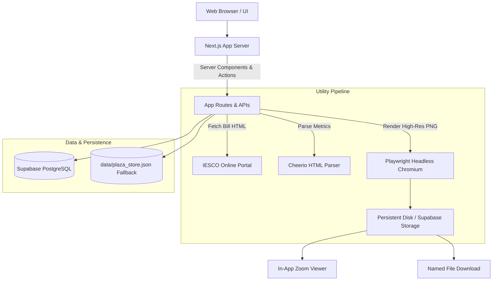
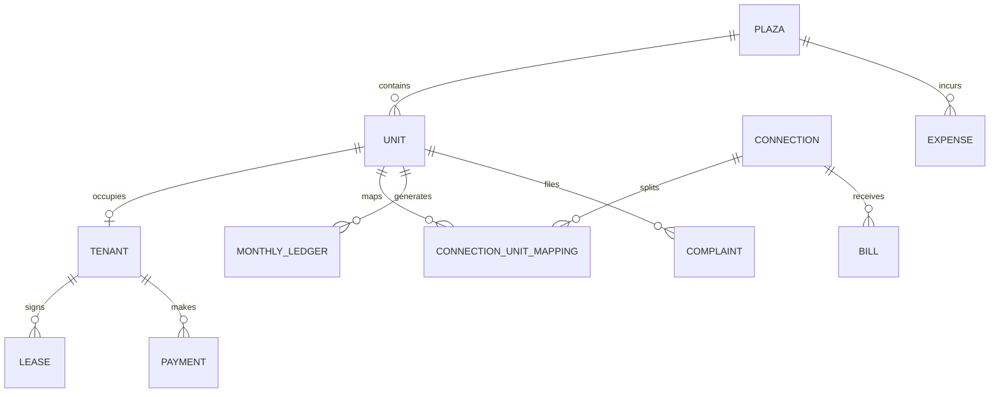

# Plaza Electricity & Property Management System — Comprehensive Project Report

> **Comprehensive Technical & Functional Documentation**  
> *Application:* **Plaza Property & Electricity Utility Management Suite**  
> *Version:* `0.1.0` (Production Ready)  
> *Date:* August 30, 2026

---

## 1. Executive Summary & Project Purpose

The **Plaza Electricity & Property Management System** is a full-stack, real-world web application built specifically for commercial plazas, shopping malls, and multi-unit commercial buildings. 

It solves three critical property management challenges in a single unified interface:
1. **Property & Tenant Administration**: Managing commercial spaces (shops, rooms, offices, halls) across multiple floors, assigning tenants, managing leases, tracking security deposits, and processing move-outs/vacations.
2. **Automated Utility & IESCO Electricity Bill Management**: Live scraping and high-resolution rendering of official utility bills from the Islamabad Electric Supply Company (**IESCO**) portal, supporting 1-to-1 dedicated meters and multi-unit shared meters (with percentage/equal bill splitting), persistent document storage, in-app full-size zoomable bill preview, and one-click downloads.
3. **Financial Accounting & Rent Roll**: Unified monthly ledgers calculating base rent, allocated electricity utility share, maintenance fees, payment receipt logging, arrears, expense tracking, and plaza financial health reports.

---

## 2. Technology Stack & Architecture

| Layer | Technology | Role / Details |
| :--- | :--- | :--- |
| **Framework** | **Next.js 16 (App Router + Turbopack)** | Full-stack React framework with server components, server actions, and API routes. |
| **Language** | **TypeScript 5.x** | Strict end-to-end type safety across client and server. |
| **Frontend UI** | **React 19, Tailwind CSS, Lucide Icons** | Contemporary design system using earthen/neutral warm palette (`#FAF6F0`, `#E8EDD9`, `#17211D`, `#CBD4BC`, `#FF704D`). |
| **Headless Browser Engine** | **Playwright (Chromium)** | High-fidelity headless browser that renders official IESCO bill HTML and captures crystal-clear PNG snapshots. |
| **HTML Scraping & Parsing** | **Cheerio & Cookie-Jar Fetch** | Emulates session cookies to query IESCO portal (`https://bill.pitc.com.pk/iescobill`) and extract structured billing metrics. |
| **Primary Database** | **Supabase (PostgreSQL)** | Cloud SQL database storing units, leases, payments, bills, connections, and audit logs. |
| **Storage Engine** | **Dual Storage (Disk + Supabase Storage)** | High-res bill PNGs stored in `public/uploads/electricity-bills/...` and mirrored to Supabase `electricity-bills` bucket. |
| **Offline Resilience / Fallback** | **Atomic JSON File Store (`data/plaza_store.json`)** | Complete zero-configuration local persistence fallback ensuring the app operates seamlessly offline or during database reconfiguration. |



---

## 3. Directory & File Structure

```
PLAZA-ELECTRICITY-MANAGER/
├── app/                                 # Next.js App Router (Pages, Layouts & Endpoints)
│   ├── layout.tsx                       # Global layout with Navigation Sidebar & Header
│   ├── page.tsx                         # Executive Dashboard (KPIs, Occupancy, Revenue)
│   ├── units/                           # Commercial Spaces (Shops & Rooms)
│   │   ├── page.tsx                     # Space directory grouped by floors
│   │   ├── actions.ts                   # Server actions for unit CRUD
│   │   └── [id]/page.tsx                # Space 360° Detail View
│   ├── tenants/                         # Tenant Management
│   │   ├── page.tsx                     # Tenant directory with lease status & IESCO meters
│   │   ├── actions.ts                   # Onboarding, editing, and move-out actions
│   │   └── [id]/page.tsx                # Tenant profile, ledger history & lease details
│   ├── connections/                     # Electricity & Meters
│   │   ├── page.tsx                     # All meter connections (Dedicated & Shared)
│   │   └── [id]/page.tsx                # Connection detail & split formula
│   ├── rent/                            # Rent Roll & Ledgers
│   │   └── page.tsx                     # Monthly rent ledgers & payment tracking
│   ├── expenses/                        # Plaza Expenses
│   │   └── page.tsx                     # Operational outflow & maintenance expense logging
│   ├── complaints/                      # Maintenance Complaints
│   │   └── page.tsx                     # Issue tickets & repair status
│   ├── reports/                         # Financial & Occupancy Analytics
│   │   └── page.tsx                     # Exportable PDF/CSV revenue summaries
│   ├── logs/                            # Audit Logs
│   │   └── page.tsx                     # System timeline & user activity log
│   ├── automation/                      # Automated Jobs & CRON settings
│   │   └── page.tsx                     # IESCO bill auto-sync, rent escalation
│   └── api/                             # Backend API Routes
│       ├── fetch-bill/route.ts          # POST: Live scrape, parse & store IESCO bill
│       ├── bill-image/route.ts          # POST/GET: Stream high-res bill PNG
│       ├── bills/[id]/download/route.ts # GET: Download bill with formatted filename
│       ├── bills/[id]/file/route.ts     # GET: Serve bill image inline for preview
│       └── automation/                  # Automation endpoints (sync, escalations)
│
├── components/                          # Modular React Client & Server Components
│   ├── ui/                              # Atoms (Sidebar, MetricCard, StatusBadge, EmptyState)
│   ├── units/                           # UnitsManager, UnitDetailView, AddUnitModal, EditUnitModal, ConnectMeterModal
│   ├── tenants/                         # TenantsManager, AddTenantModal, EditTenantModal, VacateTenantModal
│   ├── connections/                     # ConnectionsManager, ConnectionUnitMappingModal
│   ├── bills/                           # ViewBillModal (Full-Size Viewer), BillHistoryList, FetchBillForm
│   ├── payments/                        # RecordPaymentModal
│   ├── complaints/                      # ComplaintsManager, AddComplaintModal
│   └── expenses/                        # ExpensesManager, AddExpenseModal
│
├── lib/                                 # Business Logic, Data Access & Utilities
│   ├── iesco/                           # IESCO Utility Core
│   │   ├── fetch-bill.ts                # Session cookie jar & form serialization
│   │   ├── parse-bill.js                # Cheerio HTML parser for bill metrics
│   │   ├── generate-image.ts            # Playwright browser screenshot capture
│   │   └── save-bill-image.ts           # Dual-storage coordinator
│   ├── bills/                           # Bill Storage & Services
│   │   ├── bill-storage.ts              # File persistence & custom filename generator
│   │   └── service.ts                   # Bill record querying, uniqueness & history
│   ├── units/service.ts                 # Unit CRUD, floor sorting & metrics
│   ├── tenants/service.ts               # Tenant onboarding, leases, vacate workflows
│   ├── electricity/service.ts           # Meter connections, 1-to-1 and shared split math
│   ├── payments/service.ts              # Payment transactions, receipts, remaining balance
│   ├── ledgers/service.ts               # Rent roll calculations & monthly balances
│   ├── expenses/service.ts              # Plaza operational expenses
│   ├── complaints/service.ts            # Repair tickets & workflows
│   ├── logs/service.ts                  # Audit trail logger
│   ├── storage/fileStore.ts             # Atomic JSON file persistence engine
│   └── supabase/server.ts               # Supabase database & storage client
│
├── public/                              # Static Web Assets
│   └── uploads/electricity-bills/       # Persistent local storage for IESCO bill PNGs
├── data/                                # Local persistence data
│   └── plaza_store.json                 # Atomic JSON database
└── package.json                         # Dependencies & project configuration
```

---

## 4. In-Depth Feature Breakdown

### 4.1. Dashboard & Plaza Overview (`/`)
- **Key Performance Indicators (KPIs)**:
  - Total Monthly Revenue (Base Rent + Utilities Collected).
  - Occupancy Rate (% occupied units vs total units).
  - Outstanding Rent & Utility Arrears.
  - Active Maintenance Complaints requiring attention.
- **Visual Floorplan Status**: Interactive overview of Basement, Ground Floor, 1st Floor, 2nd Floor, and Rooftop units with color-coded occupancy states.
- **Quick Action Center**: One-click shortcuts to Onboard Tenant, Record Payment, Sync Electricity Bills, and Log Expense.

---

### 4.2. Commercial Spaces (Shops & Rooms) (`/units` & `/units/[id]`)
- **Floor-Based Organization**: Spaces are categorized by floor (Basement, Ground, 1st, 2nd, Rooftop) with type definitions (SHOP, ROOM, OFFICE, HALL).
- **Space Cards**:
  - Clear labels: "Assign Tenant" for vacant spaces, tenant name and rent for occupied spaces.
  - Quick action buttons: **Open Space**, **Edit Specs**.
- **360° Space Detail View (`/units/[id]`)**:
  - **Unit Information Card**: Unit name, floor, area (sq ft), base rent, status badge.
  - **Electricity Utility Card**: Shows assigned IESCO 14-digit reference number, meter serial, connection type (Dedicated 1-to-1 vs Shared Split), latest bill amount, due date, and quick action buttons (`[ View Bill → ]`, `[ Change Meter ]`, `[ Sync IESCO ]`).
  - **Security Deposit Card**: Amount required vs amount paid and deposit status (`Fully Paid ✓` / `Held on File`).
  - **Tabbed Activity Section**:
    1. **Payments Tab**: History of all payments logged for this unit with receipt numbers.
    2. **Monthly Ledgers Tab**: Historical breakdown of base rent, electricity charges, payments, and remaining balance month-by-month.
    3. **Bill History Tab**: List of all historical IESCO electricity bills for this unit with **View Bill** and **Download** actions.
    4. **Repairs Tab**: Maintenance complaints and status updates for this unit.

---

### 4.3. Tenant & Lease Management (`/tenants` & `/tenants/[id]`)
- **Tenant Directory**:
  - Complete list of active and past tenants.
  - Tenant details: Full Name, CNIC / National ID, Phone Number, Assigned Unit, Monthly Rent, Lease Expiry Date.
  - **IESCO Meter Tag**: Shows the assigned 14-digit meter reference number directly on the tenant card.
  - Direct Action Buttons: **Edit Data** and **Remove Tenant** (Vacate workflow).
- **Tenant Onboarding Workflow (`AddTenantModal.tsx`)**:
  - Captures Tenant Personal Details (Name, CNIC, Phone, Emergency Contact).
  - Selects Unit/Shop.
  - Sets Lease Terms: Start Date, Duration (e.g. 11 months / 1 year), Monthly Rent, Security Deposit.
  - **Integrated Electricity Setup**: Allows entering the 14-digit IESCO Reference Number and Meter Serial immediately during tenant assignment without requiring a separate menu step.
- **Tenant Move-Out / Vacate Workflow (`VacateTenantModal.tsx`)**:
  - Handles lease termination, move-out date, security deposit deductions, refunded amounts, and automatically marks the unit as `VACANT`.

---

### 4.4. Electricity & Meter Utility Engine (`/connections`)
- **Connection Types**:
  - **Dedicated (1-to-1)**: Single shop connected to a single physical IESCO meter.
  - **Shared Meter (1-to-Many)**: Single commercial IESCO meter powering multiple sub-units (e.g. 3 shops sharing a main meter).
- **Shared Split Configuration (`ConnectionUnitMappingModal.tsx`)**:
  - Allows assigning custom split formulas (Equal Split or Custom Percentage e.g. Shop 1: 50%, Shop 2: 30%, Shop 3: 20%).
  - Automatically calculates each unit's exact electricity charge on the monthly rent ledger.
- **IESCO Bill Scraping Pipeline (`lib/iesco/`)**:
  - Queries `https://bill.pitc.com.pk/iescobill` with the 14-digit reference number.
  - Parses HTML using Cheerio to extract: Consumer Name, Billing Month, Issue Date, Due Date, Units Consumed (kWh), Payable Within Due Date, Payable After Due Date, Meter Number, and Tariff.
  - Headless Chromium (Playwright) renders the official bill HTML and captures a crisp, high-resolution PNG image.

---

### 4.5. Persistent Bill Storage, Large Viewer & Downloads
- **Permanent File Storage**:
  - Stored under `public/uploads/electricity-bills/{plaza_id}/{connection_id}/{billing_month}/bill.png` and mirrored to Supabase Storage.
  - Avoids storing bloated base64 strings in JSON/Database records.
  - Uniqueness constraint on `(connection_id + billing_month)` prevents duplicate records on repeated searches or syncs.
- **In-App Full-Size Viewer Modal (`ViewBillModal.tsx`)**:
  - Full-screen / large responsive modal preserving native bill aspect ratio.
  - Interactive zoom toolbar: **Zoom In (`+`)**, **Zoom Out (`−`)**, **Zoom Level (%)**, and **Fit to Screen (`100%`)**.
  - Smooth pan and scroll support for inspecting line items, meter readings, and taxes.
  - Top financial metrics bar: Month, Units consumed, Amount Payable, Due Date, Reference Number.
  - Built-in **Print** and **Download Bill** buttons.
  - Clear **Close (`✕`)** button and keyboard `Escape` handler with **zero browser popups**.
- **Named Direct Downloads**:
  - Clean, professional filename format: `electricity-bill-{reference_number}-{billing_month}.png` (e.g. `electricity-bill-15142165162900-2026-08.png`).

---

### 4.6. Rent Roll, Ledgers & Payment Logging (`/rent`)
- **Monthly Ledger Engine**:
  - Automatically generates ledger rows combining Base Rent + Allocated Electricity Utility + Maintenance Fees.
  - Computes paid amount and remaining balance.
- **Payment Recording (`RecordPaymentModal.tsx`)**:
  - Records payments for Rent, Electricity, Security Deposit, or Maintenance.
  - Supports Cash, Bank Transfer, Online, and Cheque with transaction reference numbers.
  - Automatically updates remaining balances and marks bills as Paid/Unpaid.

---

### 4.7. Maintenance Complaints & Plaza Expenses (`/complaints` & `/expenses`)
- **Complaints (`/complaints`)**:
  - Ticket title, category (Plumbing, Electrical, Structural, HVAC), priority (Low, Medium, High, Urgent), and status (PENDING, IN_PROGRESS, RESOLVED).
  - Linked to specific unit and tenant.
- **Expenses (`/expenses`)**:
  - Plaza operational outflow logging (Generator diesel, common area electricity, security staff salaries, janitorial supplies).
  - Categorized for net profit calculation.

---

### 4.8. Automated Background Tasks (`/automation`)
- **Monthly Ledger Generation**: Automatically generates new monthly bills on the 1st of every month.
- **Rent Escalation Engine**: Automatically applies annual percentage increases (e.g. +10% after 11 months) based on lease agreements.
- **Plaza-Wide IESCO Auto-Sync**: Background sync that iterates through all active plaza meters, checks for newly released bills, renders snapshots, and records updated utility charges.

---

## 5. API Endpoints Reference

| Endpoint | Method | Description |
| :--- | :--- | :--- |
| `/api/fetch-bill` | `POST` | Fetches live IESCO bill HTML, parses metadata, captures high-res PNG, saves file to persistent storage, and creates/updates database bill record. |
| `/api/bill-image` | `GET` / `POST` | Fetches and streams the high-resolution bill PNG buffer for a given reference number. |
| `/api/bills/[id]/download` | `GET` | Streams the saved bill file as a downloadable attachment with custom filename (`electricity-bill-{ref}-{month}.png`). |
| `/api/bills/[id]/file` | `GET` | Serves the saved bill image inline with HTTP cache headers for quick browser preview. |
| `/api/automation/sync-bills` | `POST` | Triggers plaza-wide auto-sync of all configured IESCO meter connections. |
| `/api/automation/monthly-ledgers` | `POST` | Triggers generation of monthly rent + electricity ledger entries. |
| `/api/automation/rent-escalation` | `POST` | Evaluates active leases and applies scheduled annual rent escalations. |

---

## 6. Database Schema & Data Models

### 6.1. Entities & Fields



- **`plazas`**: `id`, `name`, `address`, `total_floors`, `created_at`
- **`units`**: `id`, `plaza_id`, `floor`, `unit_name`, `unit_type`, `area_sqft`, `default_monthly_rent`, `default_security_amount`, `status` (`VACANT`, `OCCUPIED`, `MAINTENANCE`), `reference_number`, `meter_number`
- **`tenants`**: `id`, `full_name`, `cnic`, `phone`, `email`, `emergency_contact`, `status` (`ACTIVE`, `VACATED`)
- **`leases`**: `id`, `tenant_id`, `unit_id`, `start_date`, `end_date`, `monthly_rent`, `security_amount`, `security_paid`, `security_status`, `status` (`ACTIVE`, `ENDED`)
- **`connections`**: `id`, `plaza_id`, `name`, `reference_number` (14-digit IESCO), `meter_number`, `tariff`, `is_shared`, `active`
- **`connection_unit_mappings`**: `id`, `connection_id`, `unit_id`, `split_type` (`PERCENTAGE`, `EQUAL`), `split_value`, `notes`
- **`bills`**: `id`, `connection_id`, `plaza_id`, `unit_id`, `reference_number`, `billing_month`, `issue_date`, `due_date`, `bill_amount`, `late_payment_amount`, `units_consumed`, `consumer_name`, `meter_number`, `tariff`, `status` (`unpaid`, `paid`, `overdue`), `bill_file_path`, `bill_file_url`
- **`payments`**: `id`, `tenant_id`, `unit_id`, `connection_id`, `payment_date`, `amount`, `payment_type` (`RENT`, `ELECTRICITY`, `SECURITY`, `MAINTENANCE`), `payment_method` (`CASH`, `BANK_TRANSFER`, `CHEQUE`, `ONLINE`), `receipt_number`
- **`monthly_ledgers`**: `id`, `unit_id`, `tenant_id`, `billing_month`, `rent_amount`, `electricity_amount`, `maintenance_amount`, `total_due`, `paid_amount`, `remaining_balance`, `status`
- **`complaints`**: `id`, `unit_id`, `tenant_id`, `title`, `description`, `category`, `priority`, `status`
- **`expenses`**: `id`, `plaza_id`, `title`, `amount`, `category`, `expense_date`, `paid_to`
- **`audit_logs`**: `id`, `event_type`, `description`, `user_name`, `created_at`

---

## 7. Step-by-Step User Workflows

### 7.1. Onboarding a Tenant with Electricity Meter
1. Navigate to **Shops & Rooms** (`/units`) or **Tenants** (`/tenants`).
2. Click **Add New Tenant** / **Assign Tenant**.
3. Fill in Tenant Personal Details (Name, CNIC, Phone).
4. Select the target Space / Shop.
5. Set Lease terms (Monthly Rent, Security Deposit, Start Date).
6. Enter the **14-Digit IESCO Reference Number** (e.g. `15142165162900`) and optional Meter Serial.
7. Click **Confirm & Assign Space**.
8. The system automatically creates the tenant, activates the lease, connects the meter, creates the electricity connection mapping, fetches the latest IESCO bill, and marks the unit as `OCCUPIED`.

### 7.2. Viewing & Downloading an Official Bill
1. Open any space with a meter attached (via `/units/[id]` or `/connections`).
2. In the Electricity utility section or Bill History tab, click **`[ View Bill ]`**.
3. The in-app **Full-Size Lightbox Viewer** opens:
   - Use **Zoom In (`+`)** or **Zoom Out (`−`)** to inspect fine print details.
   - Use mouse drag / scroll to examine the document.
   - Check key metrics: Units consumed, Payable amount, Due date.
4. Click **`[ Download Bill ]`** to download the clean PNG file directly to your computer.

### 7.3. Monthly Billing & Payment Collection
1. Navigate to **Rent Roll** (`/rent`).
2. Review the consolidated monthly ledger for each occupied shop (Base Rent + Allocated Electricity Share).
3. When a tenant pays, click **Record Payment**:
   - Enter payment amount and category (Rent / Electricity).
   - Select payment method (Cash / Bank Transfer).
   - Click **Save Payment**.
4. The system logs the receipt, deducts from the balance, updates status badges, and logs the audit event.

---

## 8. Development & Production Operations

### 8.1. Running the Project Locally
```bash
# Install dependencies
npm install

# Start local Next.js development server
npm run dev

# Open browser at http://localhost:3000
```

### 8.2. Building for Production
```bash
# Build optimized Next.js bundle
npm run build

# Start production server
npm run start
```

### 8.3. Offline / Mock Mode
The system features an automated fallback architecture. If Supabase is unreachable or in configuration, all queries seamlessly route to `data/plaza_store.json` and `public/uploads/`, ensuring 100% uptime with zero data loss.

---

## 9. Conclusion

The **Plaza Electricity & Property Management System** delivers a purpose-built, high-reliability solution for commercial plaza owners and property managers. By integrating automated utility scraping, high-resolution document storage, in-app zoomable viewers, and flexible multi-unit bill splitting with complete property accounting, it eliminates manual billing errors and streamlines tenant management.
